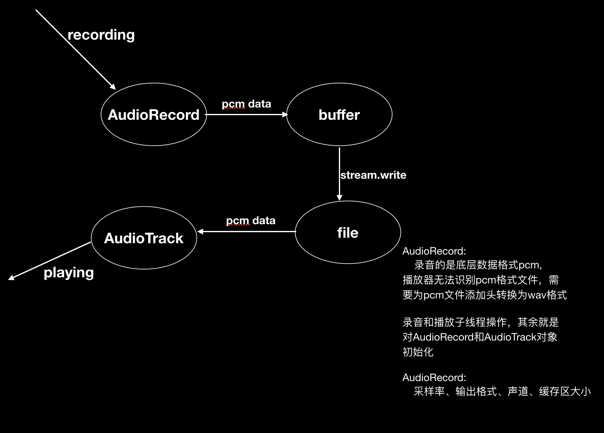

# Audio Video Record 音视频录制 

利用Android自带的MediaCodec、MediaMuxer、AudioRecorder实现视频录制并保存为mp4文件

## AudioRecord使用步骤

前提要你设定一个缓冲区Buffer，Audio将每次录音数据放到buffer，我们在把buffer的数据读出来，通过流保存到文件

1. 实例化AudioRecord
2. 设定缓存区Buffer大小
3. 开始录音-子线程
4. 创建流输出到file
5. 关闭数据流
5. 停止录音，释放内存

## 框架图

项目还未完成，等待

